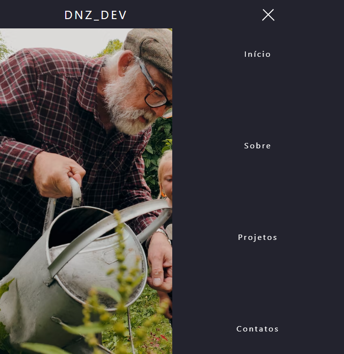

# NAV BAR 

>Barra de Navegação

Projeto construído e aplicado com bases em estudos de CSS e JavaScript.

Lembrando: A barra é responsiva barra o mobile, ela é ativada em uma proporção menor.

[Clique aqui para acessar](https://emanueldinizz.github.io/Nav_Bar)

## 🖥️ Tecnologias

- HTML
- CSS
- JavaScript
- Git e Github

## Contato 

emanueldiniz34@gmail.com
LinkedIn: emanueldinizz